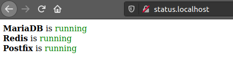

# status-page

Simple status page for determine linux services are running or are stopped



## Setup

Inside the **nginx** folder you have a virtualhost example file: **status.conf**

### ubuntu / debian

```shell
cp nginx/status.conf /etc/nginx/sites-available
cd /etc/nginx/sites-enabled
sudo ln -s ../sites-available/status.conf
sudo service nginx reload
```
